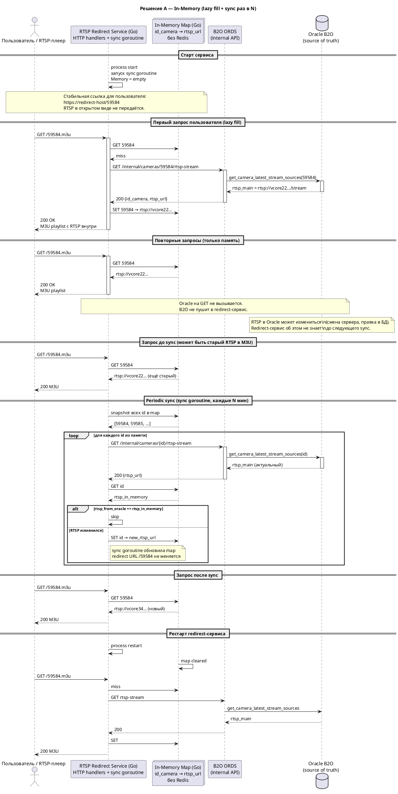
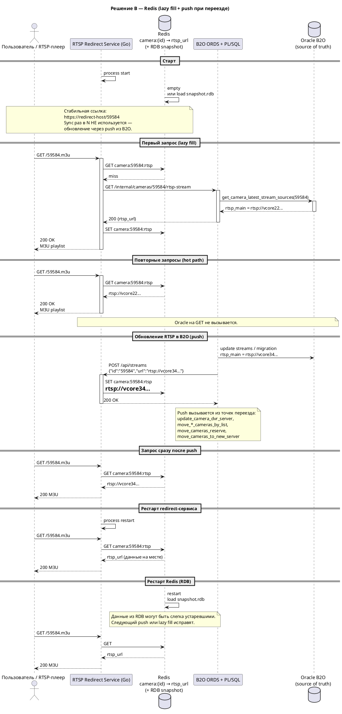

# RTSP Redirect Service — архитектура

Документ собран по итогам проектирования. Отдельно отмечено, что уже есть в прототипе и что целевое решение.

---

## 1. Назначение

Сервис даёт **постоянную RTSP-ссылку** на поток камеры:

```
rtsp://redirect-host:8554/camera/key/{id_camera}
rtsp://redirect-host:8554/{id_camera}   (короткий путь)
```

Клиент делает `DESCRIBE` → **302** + `Location: rtsp://vcore.../...`. Целевой RTSP меняется при переезде, стабильный URL — нет.

При смене медиасервера (`vcore22` → `vcore34`) **redirect URL не меняется**, меняется только RTSP за кулисами.

---

## 2. Компоненты

**1) RTSP Redirect Service (Go)**  
RTSP-сервер (редирект 302) + HTTP API для регистрации. Хранит `id_camera → rtsp_url`.  
Внутри одного процесса: in-memory map (A), Redis-клиент (B), sync-горутина (A).

**2) In-memory map (сценарий A)**  
`map[id_camera]rtsp_url` в процессе сервиса. Привязка redirect ↔ RTSP. При рестарте процесса map пустая.

**3) Redis (сценарий B)**  
Ключ `camera:{id_camera}:rtsp`. Общий для нескольких инстансов. RDB snapshot на диске. Переживает рестарт redirect-сервиса.

**4) B2O Backend (ORDS + Oracle)**  
Источник правды по RTSP. Функция `vc.get_camera_latest_stream_sources(id_camera).rtsp_main`.  
Internal-ручка: `GET /internal/cameras/{id_camera}/rtsp-stream`.

**5) Sync-горутина (сценарий A, внутри сервиса)**  
Не отдельный сервис. Запускается в `main()` при старте redirect-сервиса, тикает раз в N минут.  
Обходит id **только из in-memory map**. Сверяет RTSP с Oracle через B2O. При расхождении — обновляет map.  
Oracle **не уведомляет** сервис о переезде — узнаём только этим опросом.

**6) Push при переезде (сценарий B)**  
После migration в B2O вызывается `POST /api/streams` → обновление Redis. Sync-горутина **не нужна**, если push закрыт во всех точках переезда.

**7) Потребители**  
RTSP-плеер (VLC), camera agent, ffmpeg — подключаются к стабильному `rtsp://redirect-host:8554/...`.

---

## 3. Сценарий A — In-memory

**1)** Старт: память пустая, bulk не делаем.

**2)** Первый `GET /{id_camera}`: miss → запрос в B2O/Oracle → `SET` в map → ответ клиенту.

**3)** Повторные `GET`: только map → ответ. Oracle не вызывается.

**4)** Sync-горутина раз в N минут: для каждого id в map — запрос RTSP в Oracle → сравнение → update при отличии.

**5)** Переезд камеры в Oracle: сервис не знает до следующего sync. Задержка актуализации — до N минут.

**6)** Рестарт redirect-сервиса: map пустая → снова lazy fill на первом GET.

**7)** Один инстанс. Несколько реплик без Redis — не подходит.

---

## 4. Сценарий B — Redis

**1)** Старт: Redis пуст или восстановлен из RDB.

**2)** Первый `GET /{id_camera}`: miss в Redis → B2O/Oracle → `SET` → ответ.

**3)** Повторные `GET`: только Redis.

**4)** При переезде: B2O делает `POST /api/streams` → `SET` в Redis. RTSP обновляется сразу.

**5)** Periodic sync **не обязателен**, если push есть во всех точках migration. Reconcile — опциональная страховка.

**6)** RDB: после рестарта Redis данные могут быть слегка устаревшими — reconcile или push исправляют.

**7)** Несколько инстансов redirect → один Redis.

---

## 5. Сравнение подходов к обновлению RTSP

| | In-memory + sync | Redis + push |
|---|------------------|--------------|
| Узнаём о смене RTSP | Sync раз в N | POST при переезде |
| Задержка после переезда | До N минут | Почти сразу |
| Рестарт redirect | Память теряется | Redis сохраняет |
| Сложность B2O | Только ORDS read | ORDS + хуки в migration |
| Oracle на каждый GET | Нет | Нет |

**Oracle на каждый GET** (без хранилища) — проще, но дороже для Oracle и не даёт стабильной привязки в памяти без лишних запросов. Для продукта выбраны хранилище + lazy fill.

---

## 6. Прототип (сейчас на Render)

Уже реализовано упрощённо:

- In-memory map **без TTL** — запись живёт до следующего `POST /api/streams`
- `POST /api/streams` — регистрация/обновление RTSP (ручной push)
- RTSP `DESCRIBE` на `/camera/key/{id}` или `/{id}` → **302** + `Location: rtsp://...`
- ID из имени потока (`oooprovzor_59584` → `59584`), целевое — `id_camera` из `vc.cameras`
- Нет sync-горутины, нет интеграции с Oracle

Прототип для проверки идеи. Целевое — сценарий A или B ниже.

---

## 7. Формат ответа клиенту

**RTSP:** `DESCRIBE rtsp://redirect-host:8554/camera/key/{id}` → `302 Found` + `Location: rtsp://vcore.../...`.

HTTP только для `POST /api/streams` и `GET /health`.

---

## 8. PlantUML — решение A (In-memory)



---

## 9. PlantUML — решение B (Redis)



---

## 10. План работ — сценарий A (In-memory)

Создать PL/SQL-обёртку `get_rtsp_main_for_redirect(id_camera)` / [~kondratev.do] / 4 ч

Сделать ORDS `GET /internal/cameras/{id_camera}/rtsp-stream` / [~kondratev.do] / 4 ч

Добавить HTTP-клиент к B2O в redirect-сервис / [~kondratev.do] / 4 ч

Сделать lazy fill на GET: miss → B2O → map → M3U / [~kondratev.do] / 6 ч

Сделать GET из map без Oracle / [~kondratev.do] / 2 ч

Сделать sync-горутину внутри redirect-сервиса: тик раз в N минут, сверка map с Oracle / [~kondratev.do] / 8 ч

Перейти на `id_camera` из `vc.cameras`, убрать парсинг из stream name / [~kondratev.do] / 2 ч

Убрать ручной POST как основной путь (оставить только для отладки) / [~kondratev.do] / 2 ч

Обработка ошибок B2O: 404, 503 / [~kondratev.do] / 4 ч

Деплой и smoke-тесты / [~kondratev.do] / 4 ч

Интеграционный тест: смена RTSP в Oracle → через N мин новый RTSP в M3U / [~kondratev.do] / 6 ч

**Итого: ~46 ч**

---

## 11. План работ — сценарий B (Redis)

Поднять Redis, RDB persistence / [~kondratev.do] / 6 ч

Заменить map на Redis в redirect-сервисе / [~kondratev.do] / 4 ч

Lazy fill и hot path через Redis / [~kondratev.do] / 6 ч

POST `/api/streams` для push / [~kondratev.do] / 3 ч

Push из `update_camera_dvr_server` / [~kondratev.do] / 4 ч

Push из `move_rtsp_cameras_by_list` и `move_push_cameras_by_list` / [~kondratev.do] / 6 ч

Push из `move_cameras_reserve` и `move_cameras_to_new_server` / [~kondratev.do] / 4 ч

PL/SQL-хелпер: rtsp_main + HTTP POST в redirect / [~kondratev.do] / 6 ч

ORDS internal GET (если ещё нет) / [~kondratev.do] / 8 ч

Fallback при падении Redis / [~kondratev.do] / 4 ч

Деплой, smoke, тест push после переезда / [~kondratev.do] / 8 ч

**Итого: ~55 ч** (минус 8 ч, если ORDS уже есть)

---

## 12. План работ — доработка прототипа (уже частично сделано)

M3U вместо 301 для VLC / [~kondratev.do] / 2 ч — **сделано**

Content-Type `audio/x-mpegurl` / [~kondratev.do] / 1 ч — **сделано**

Документация тестовых команд / [~kondratev.do] / 1 ч

---

## 13. Рекомендация по этапам

**Этап 1 (MVP):** прототип на Render — POST + M3U, ручная регистрация. Проверка VLC и идеи стабильной ссылки.

**Этап 2:** сценарий A — ORDS + lazy fill + sync. Без правок migration в B2O.

**Этап 3:** сценарий B — если нужны несколько инстансов и мгновенное обновление после переезда.

---

## 14. Параметры для решения

Перед этапом 2 зафиксировать:

- интервал sync **N** (минут) — допустимая задержка после смены RTSP;
- порядок **curl/мин** на redirect;
- число камер, которые реально используют ссылку;
- нужен ли **301** помимо M3U для агентов.
